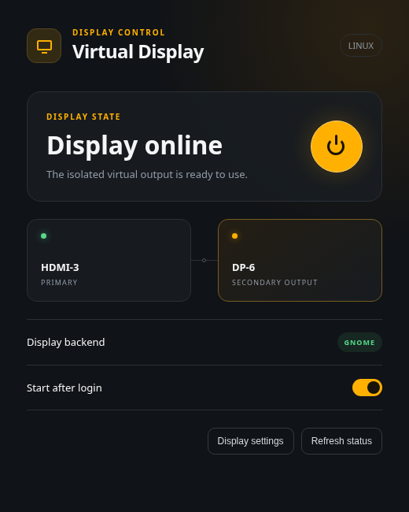

# Virtual Display

**Share a dedicated screen through Sunshine without an HDMI or DisplayPort dummy plug.**

[](https://github.com/ErickWendel/virtual-display/actions/workflows/ci.yml)
[](LICENSE)
[](#current-support)

Virtual Display was created for people who use
[Sunshine](https://github.com/LizardByte/Sunshine) to stream their desktop and
games but do not want to keep a physical dummy dongle connected to the GPU.
It gives you a friendly tray control for an existing software-provisioned
monitor: turn the streaming display on when you need it, then remove it from
your desktop when the session is over.

No dummy plug. No extra cable. No permanently extended desktop.

<p align="center">
  
</p>

## Why use it?

A dedicated virtual monitor lets Sunshine capture a predictable output without
sharing your physical screen or changing its resolution. Virtual Display keeps
that output out of the way until it is actually needed.

- Enable or disable the virtual output from the system tray.
- Keep the physical display primary.
- Start automatically after login while the virtual output remains disabled.
- Open GNOME Display Settings directly from the app.
- Avoid buying and maintaining an HDMI or DisplayPort dummy plug.
- Use the display with Sunshine, screen recorders, test tools, or any other app.

Virtual Display is independent from Sunshine. It does not change Sunshine's
configuration and can be used with any software that benefits from a separate
monitor.

## How it works

1. The operating system exposes a virtual DRM connector using EDID firmware or
   another platform-specific virtual display driver.
2. Virtual Display discovers the physical and virtual connectors.
3. The tray menu applies a safe GNOME layout through `gdctl` when you choose
   **Enable Virtual Display** or **Disable Virtual Display**.

The application intentionally does not install a display driver. Provisioning
is hardware- and operating-system-specific, and forcing the wrong connector can
make a login screen inaccessible.

## Current support

- Linux with GNOME, Wayland, and `gdctl`.
- A virtual DRM connector supplied through the kernel's
  `drm.edid_firmware=CONNECTOR:FILE` argument.
- Exactly one active physical monitor.

If multiple physical monitors are active, the app refuses to change the layout
rather than risk disabling or rearranging them. Windows and macOS backends are
planned but not implemented yet.

## Build

Node.js 22.12 or newer is required. On immutable Bazzite systems, Node can be
installed through Linuxbrew without changing the base image.

```bash
brew install node
npm ci
npm test
npm run dist
```

The Linux build creates `dist/virtual-display-1.0.0-x86_64.AppImage`.

## Install

```bash
./scripts/install.sh
```

The installer copies the packaged AppImage under `~/.local/lib`, creates the
desktop launcher, starts the tray process, and enables launch after login. It
does not modify kernel arguments, GDM, Sunshine, Steam, or existing monitor
configuration files.

## Tray controls

The monitor icon appears in GNOME's top bar through the AppIndicator extension.

- **Open Virtual Display** opens the status window.
- **Enable Virtual Display** adds the virtual monitor to the desktop.
- **Disable Virtual Display** removes it while keeping the physical display.
- **Refresh** checks the current GNOME display state.
- **Quit** stops the tray application.

Closing the status window keeps the tray process running.

## Uninstall

```bash
./scripts/rollback.sh
```

Uninstall removes only the application, launcher, icon, and autostart entry. It
intentionally leaves virtual-display drivers and kernel provisioning alone.

## EDID development

`build/generic-4k60.bin` is the EDID used while developing the Linux backend.
It advertises common modes up to 4K at 60 Hz, HDR10, 10-bit color, and stereo
audio. Rebuild and validate it with:

```bash
./scripts/generate-edid.sh
```

Do not deploy an EDID unless `edid-decode --check` reports
`EDID conformity: PASS`.

## Contributing

Windows and macOS need their own implementations behind the existing platform
backend boundary. Contributions for additional compositors, virtual display
drivers, packaging formats, and safer multi-monitor preservation are welcome.

## Project layout

- `app/`: Electron main process, renderer, preload bridge, and OS backends.
- `test/`: backend parser and safety tests.
- `scripts/`: application installation, removal, screenshot, and EDID tooling.
- `vendor/edid-generator/`: required EDID generator modules and original license.

## License

Virtual Display is released under the MIT License. See `LICENSE` and
`THIRD_PARTY_NOTICES.md`.
